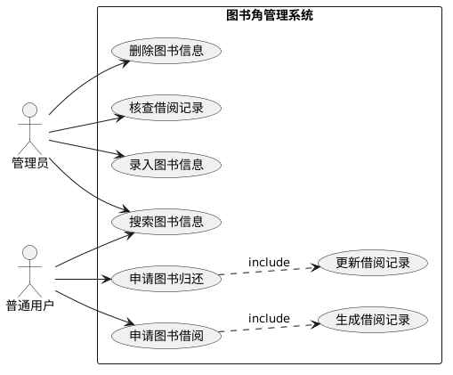
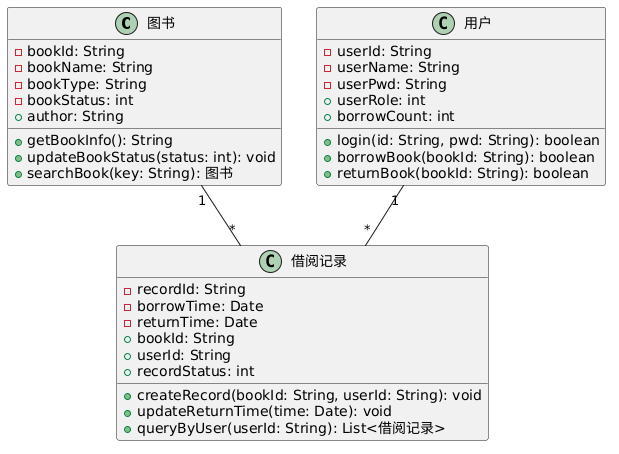

# 图书角管理系统 UML 建模
本项目包含班级图书角管理系统的用例图与类图设计。

## 项目文件
- `用例图.png`：系统功能用例图（用户/管理员角色及功能）。
- `类图.png`：核心实体类关系图（图书、用户、借阅记录）。

## 提交历史规范
采用 Conventional Commits 规范书写提交信息：
1. **Initial commit**：初始化项目仓库，添加 README。
2. **feat: add use case and class diagram**：添加系统 UML 图图片文件。
3. **docs: update README**：完善项目说明文档与展示格式。

## 系统图示
### 用例图

### 类图

